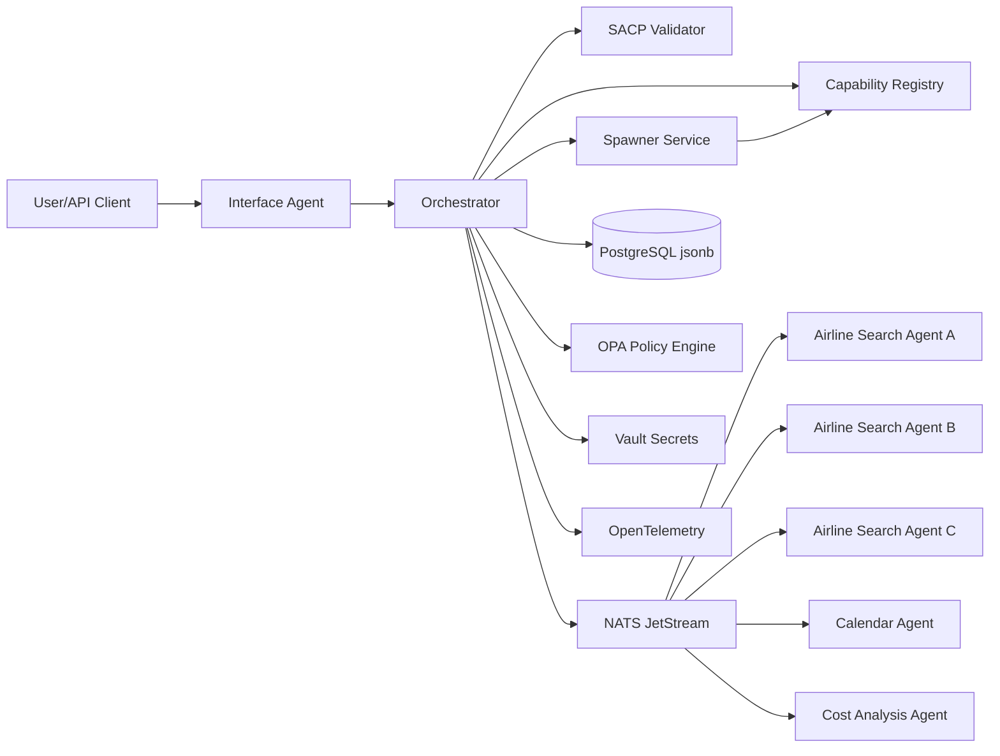
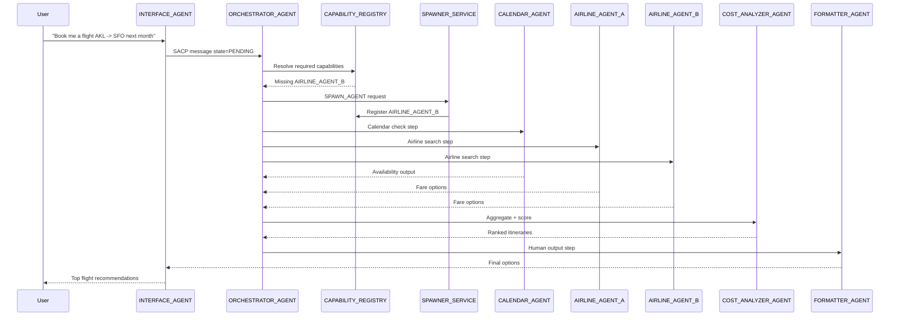
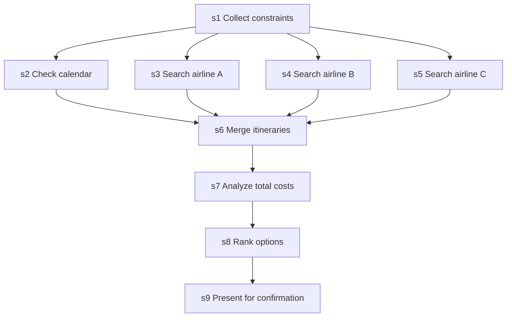

# SACP Implementation Example: Multi-Agent Flight Booking

## Purpose

This document shows how to implement a production-oriented multi-agent system using SACP v1.0.0 for the example goal `BOOK_FLIGHT`.

The workflow demonstrates:
- An orchestrator that plans and tracks execution
- Dynamic agent spawning for missing capabilities
- Parallel airline search
- Calendar checks and cost analysis
- Final ranked options for user confirmation

## Target Architecture



## Agent Roles

| Agent | Main Responsibility | Example `verb`/`tool` |
|---|---|---|
| `INTERFACE_AGENT` | Converts user request to SACP, handles final user output | `collect` / `USER_INPUT` |
| `ORCHESTRATOR_AGENT` | Validates, routes, tracks lifecycle, joins outputs | `dispatch` / `TASK_ROUTER` |
| `CALENDAR_AGENT` | Checks schedule constraints and conflicts | `check` / `CALENDAR_AVAIL` |
| `AIRLINE_AGENT_*` | Fetches itineraries for one airline or provider | `search` / `AIRLINE_API` |
| `COST_ANALYZER_AGENT` | Computes total cost, fees, scoring | `analyze` / `FARE_SCORER` |
| `FORMATTER_AGENT` | Produces user-facing recommendation | `format` / `PRESENT` |
| `SPAWNER_SERVICE` | Creates and registers new specialized agents | `instantiate` / `AGENT_FACTORY` |

## End-to-End Flow



## Execution Plan Shape

This example uses object-form steps from SACP v1.0.0 with dependencies.



## Implementation Steps

### 1. Build the protocol boundary

1. Validate every inbound message with `schema/sacp.schema.json`.
2. Reject invalid payloads with `state=FAILED` and canonical `error.code`.
3. Persist accepted messages and transitions in PostgreSQL `jsonb`.

### 2. Implement orchestrator runtime

1. Enforce SACP lifecycle transitions.
2. Resolve each step by `verb` + `tool` in the registry.
3. Execute dependency-ready steps in parallel.
4. Apply timeout/retry/on_error rules per step.
5. Emit terminal `DONE` with `result` or `FAILED` with `error`.

### 3. Add capability registry and spawning

1. Maintain registry records for all active agents.
2. On missing capability, emit a `g=SPAWN_AGENT` message.
3. Wait for spawn completion and registry update.
4. Retry blocked step routing.

### 4. Implement specialist agents

1. `CALENDAR_AGENT` returns candidate travel windows.
2. `AIRLINE_AGENT_*` returns normalized itinerary lists.
3. `COST_ANALYZER_AGENT` computes score using fare, duration, stops, baggage, refundability.
4. `FORMATTER_AGENT` emits `out_fmt=human` final payload.

### 5. Add policy and secrets

1. Check OPA policy before each tool call.
2. Pull provider credentials from Vault at execution time.
3. Enforce per-agent allowlists for tools and providers.

### 6. Add observability and conformance gates

1. Propagate `trace.trace_id` across all message hops.
2. Emit OpenTelemetry spans for validation, routing, model calls, tool calls, and joins.
3. Run `conformance-tests.md` and `tests/fixtures/*` in CI for every change.

## Example: Initial Flight Booking Request

Reference file: [initial-request.json](C:/git/SACP/examples/flight-booking/initial-request.json)

```json
{
  "proto_ver": "1.0.0",
  "msg_id": "flight-book-001",
  "ts": "2026-05-09T00:00:00Z",
  "sender": "INTERFACE_AGENT",
  "recipient": "ORCHESTRATOR_AGENT",
  "g": "BOOK_FLIGHT",
  "ctx": {
    "origin": "AKL",
    "destination": "SFO",
    "date_window": {"start": "2026-06-10", "end": "2026-06-25"},
    "passengers": 1,
    "cabin": "economy",
    "max_budget_usd": 1400,
    "calendar_id": "primary"
  },
  "plan": [
    {
      "id": "s1",
      "verb": "collect",
      "tool": "USER_INPUT",
      "params": {}
    },
    {
      "id": "s2",
      "verb": "check",
      "tool": "CALENDAR_AVAIL",
      "params": {"timezone": "Pacific/Auckland"},
      "depends_on": ["s1"],
      "timeout_ms": 4000
    },
    {
      "id": "s3",
      "verb": "search",
      "tool": "AIRLINE_API_A",
      "params": {"origin": "AKL", "destination": "SFO"},
      "depends_on": ["s1"],
      "retry": {"max_attempts": 3, "backoff_ms": 200, "strategy": "exponential"},
      "on_error": "continue"
    },
    {
      "id": "s4",
      "verb": "search",
      "tool": "AIRLINE_API_B",
      "params": {"origin": "AKL", "destination": "SFO"},
      "depends_on": ["s1"],
      "retry": {"max_attempts": 3, "backoff_ms": 200, "strategy": "exponential"},
      "on_error": "fallback",
      "fallback_step": "s10"
    },
    {
      "id": "s5",
      "verb": "search",
      "tool": "AIRLINE_API_C",
      "params": {"origin": "AKL", "destination": "SFO"},
      "depends_on": ["s1"],
      "on_error": "continue"
    },
    {
      "id": "s6",
      "verb": "merge",
      "tool": "ITINERARY_MERGER",
      "params": {},
      "depends_on": ["s2", "s3", "s4", "s5"]
    },
    {
      "id": "s7",
      "verb": "analyze",
      "tool": "FARE_SCORER",
      "params": {"weights": {"price": 0.5, "duration": 0.2, "stops": 0.2, "flex": 0.1}},
      "depends_on": ["s6"]
    },
    {
      "id": "s8",
      "verb": "rank",
      "tool": "OPTION_RANKER",
      "params": {"top_n": 5},
      "depends_on": ["s7"]
    },
    {
      "id": "s9",
      "verb": "format",
      "tool": "PRESENT",
      "params": {"currency": "USD"},
      "depends_on": ["s8"],
      "output_key": "flight_options"
    },
    {
      "id": "s10",
      "verb": "spawn",
      "tool": "AGENT_FACTORY",
      "params": {
        "missing_capability": "AIRLINE_API_B",
        "agent_name": "AIRLINE_AGENT_B"
      }
    }
  ],
  "out_fmt": "human",
  "state": "PENDING",
  "trace": {
    "trace_id": "trace-flight-001",
    "span_id": "span-root-001",
    "attempt": 1
  }
}
```

## Example: Spawn Message

Reference file: [spawn-request.json](C:/git/SACP/examples/flight-booking/spawn-request.json)

```json
{
  "proto_ver": "1.0.0",
  "msg_id": "spawn-flight-001",
  "ts": "2026-05-09T00:00:05Z",
  "sender": "ORCHESTRATOR_AGENT",
  "recipient": "SPAWNER_SERVICE",
  "g": "SPAWN_AGENT",
  "ctx": {
    "missing_capability": "AIRLINE_API_B",
    "input_hints": ["origin", "destination", "date_window", "cabin", "passengers"],
    "output_expectation": "normalized_itineraries"
  },
  "plan": [
    {
      "id": "s1",
      "verb": "define",
      "tool": "CAPABILITY_SPEC",
      "params": {
        "agent_name": "AIRLINE_AGENT_B",
        "supported_verbs": ["search"],
        "supported_tools": ["AIRLINE_API_B"]
      }
    },
    {
      "id": "s2",
      "verb": "instantiate",
      "tool": "AGENT_FACTORY",
      "params": {"agent_name": "AIRLINE_AGENT_B"},
      "depends_on": ["s1"]
    },
    {
      "id": "s3",
      "verb": "register",
      "tool": "CAPABILITY_REGISTRY",
      "params": {"agent_name": "AIRLINE_AGENT_B"},
      "depends_on": ["s2"]
    }
  ],
  "out_fmt": "raw",
  "state": "PENDING"
}
```

## Example: Final Success Response

Reference file: [final-success-response.json](C:/git/SACP/examples/flight-booking/final-success-response.json)

```json
{
  "proto_ver": "1.0.0",
  "msg_id": "flight-book-001-r1",
  "reply_to": "flight-book-001",
  "ts": "2026-05-09T00:00:12Z",
  "sender": "ORCHESTRATOR_AGENT",
  "recipient": "INTERFACE_AGENT",
  "g": "BOOK_FLIGHT",
  "plan": [
    {
      "id": "s9",
      "verb": "format",
      "tool": "PRESENT",
      "params": {"currency": "USD"}
    }
  ],
  "out_fmt": "human",
  "state": "DONE",
  "result": {
    "outputs": {
      "flight_options": [
        {"rank": 1, "price_usd": 1120, "stops": 1, "airline": "Airline A"},
        {"rank": 2, "price_usd": 1195, "stops": 1, "airline": "Airline B"},
        {"rank": 3, "price_usd": 1280, "stops": 2, "airline": "Airline C"}
      ]
    },
    "summary": "Top 3 options satisfy budget and calendar constraints"
  }
}
```

## Production Checklist For This Example

- [ ] Validator rejects malformed SACP envelopes.
- [ ] Runtime enforces allowed lifecycle transitions.
- [ ] Dependency graph checks detect cycles before execution.
- [ ] Missing capability path triggers `SPAWN_AGENT`.
- [ ] Spawned agents are registered before retrying blocked steps.
- [ ] Parallel airline steps are independently retried and merged.
- [ ] All failures map to canonical `error.code`.
- [ ] `trace_id` is present in all orchestrator and agent logs.
